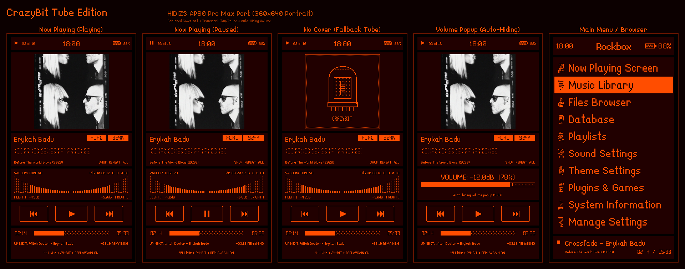
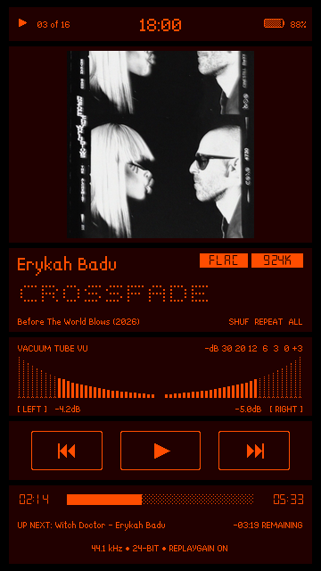
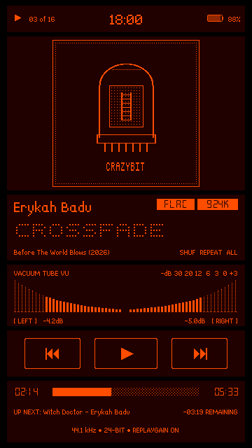
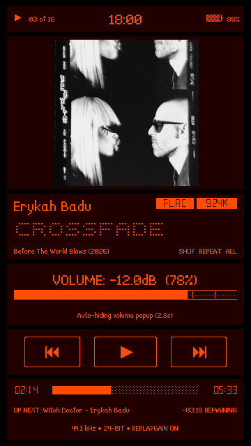
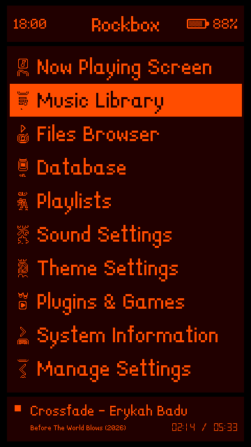

# CrazyBit Tube Edition — adapted for the Hidizs AP80 Pro Max (360 × 640)

[**Download v2.1.0 (Ready-to-install ZIP)**](https://github.com/mr-f0xx/CrazyBitTube-AP80-Pro-Max/releases/download/v2.1.0/CrazyBitTube-HIDIZS-AP80ProMax-360x640.zip)

Portrait adaptation and enhancement of the retro **CrazyBit** Rockbox theme, redesigned from the ground up for the **360 × 640 portrait touchscreen** display of the **Hidizs AP80 Pro Max**.

Inspired by vintage glowing vacuum tubes and dot-matrix nixie displays, this theme pairs a fiery neon orange foreground (**`#FF4D00`**) with dark mahogany container panels (**`#210000`**) and a pure black canvas (**`#000000`**).

---

## Showcase

<b>View Individual High-Resolution Screen Previews</b>

 

| Now Playing (Playing) | Now Playing (Paused) | Fallback Art (No Cover) |
|:---:|:---:|:---:|
|  |  |  |

| Auto-Hiding Volume Popup | SBS Main Menu / Dock |
|:---:|:---:|
|  |  |

---

## Features & Highlights

- **Tailored 360 × 640 Portrait Layout:** Full vertical screen utilization with zero dead space, custom-proportioned for the AP80 Pro Max touchscreen.
- **Fiery Vacuum Tube Color Palette:**
  - **Foreground & Text:** Fiery Neon Orange (`#FF4D00`)
  - **Panels & Button Boxes:** Dark Mahogany (`#210000`)
  - **Canvas & Separators:** Pure Black (`#000000`)
- **Now Playing Status Bar:**
  - Play-mode icon and track position on the left, battery icon + percentage on the right, and a 24-hour clock (no AM/PM) centred between them.
  - The clock uses `14-LanaPixel` (14px digits, twice the size of the other status-bar text) and sits in the exact middle of the bar, horizontally and vertically.
- **Centered Album Cover Art:**
  - Dedicated 210 × 210 cover art frame centered inside the mahogany panel (`%Cl(0,0,210,210,c,c)`).
  - Clean automatic fallback to a custom pixel-art vacuum tube graphic (`no_cover.bmp`) when a track does not contain embedded art.
- **Tactile Touchscreen Transport Controls:**
  - Large, clickable retro transport buttons:
    - **`[ |<< ]`** Previous Track / Seek Backward
    - **`[ > / || ]`** Dynamic Play/Pause Button — shows `▶` during playback/stopped, and automatically switches to `❚❚` when paused
    - **`[ >>| ]`** Next Track / Seek Forward
  - Direct touch mapping using Rockbox touchscreen action zones (`ACTION_WPS_PLAY`, `ACTION_WPS_SKIPPREV`, `ACTION_WPS_SKIPNEXT`).
- **Touch-to-Seek Progress Bar:**
  - Tap anywhere on the track bar to jump there, or drag along it to scrub (the seek happens when you lift your finger).
  - Uses a 34px-tall touch zone (`%T(...,progressbar)`) over the thin 12px bar, so it's easy to hit with a finger; the zone spans exactly the bar's width, so the position matches the bar 1:1.
- **Auto-Hiding Volume Popup (`%?mv`):**
  - Keeps the Now Playing view uncluttered: during normal playback, the peak VU meters are shown.
  - When the hardware volume dial is adjusted, an auto-hiding volume gauge smoothly pops up for 2.5 seconds before returning to the meters.
- **Stereo Butterfly Peak VU Meters:**
  - Dual sloped butterfly peak meters (`pl.bmp` and `pr.bmp`) with calibrated -dB scale markings.
- **Full CJK / Asian Character Support & Multi-Scale Typography:**
  - Bundled with `47-SquareDotCombined.fnt` and the full suite of scaled `LanaPixel` fonts (**`07`** [1x/7pt], **`14`** [2x/14pt], **`16`** [2.3x/16pt], **`17`** [2.4x/17pt], **`19`** [2.7x/19pt], **`21`** [3x/21pt], and **`28`** [4x/28pt]).
  - `16-LanaPixel.fnt` (height 32), `17-LanaPixel.fnt` (height 34) and `19-LanaPixel.fnt` (height 38) are crisp 1-bit in-between sizes: since 2.29x / 2.43x / 2.71x are not whole numbers, each pixel row/column is scaled by 2 or 3 px per glyph so strokes stay even — 2px in 16 and 17, 3px in 19 (no blurry anti-aliasing, no wobbly mixed 2/3px strokes). The number in the name is the capital-letter height in pixels. Select one under **Settings → Theme Settings → Font**, or load it in a skin with `%Fl(n,16-LanaPixel.fnt)`.
  - Renders Japanese (Kanji, Hiragana, Katakana), Chinese, Korean, and extended Latin characters cleanly without missing glyph boxes.
- **SBS Main Menu & Mini-Player Dock:**
  - Dedicated menu skin (`CrazyBitTube.sbs`) with high-contrast glowing orange inverse selection bar.
  - **Enlarged Header:** 24-hour clock on the left, the screen title ("Rockbox") in `19-LanaPixel` exactly in the middle of the header (same space above and below, left and right), and a 32×14 battery icon + percentage on the right with the same 10px edge padding as the clock.
  - The header battery icon is drawn from a tiny helper font (`14-CrazyBitTube-Battery.fnt`: LanaPixel 14 digits + 10 battery-level glyphs), so the icon always stays 6px from the number whatever its width. It is not meant to be picked as a menu font.
  - **Touch-Friendly Enlarged List Rows:** Uses the 3x LanaPixel font (`21-LanaPixel.fnt`) for menus. Row spacing and separators are left to your player's own settings (the theme doesn't override them); with **Line Padding in Lists** set to `6` (*Settings → General Settings → Display → Touchscreen Settings*) rows are 48px and fill the portrait display without dead space.
  - Persistent bottom mini-player dock displaying current playback status, track metadata, and time.
  - Custom USB Disk Mode screen with animated USB illustration and charging metrics.

---

## Installation

### Quick Install (ZIP Release)

1. Download the latest `CrazyBitTube-HIDIZS-AP80ProMax-360x640.zip` from the [Releases](https://github.com/mr-f0xx/CrazyBitTube-AP80-Pro-Max/releases) page.
2. Connect your **Hidizs AP80 Pro Max** to your computer via USB (in Mass Storage mode) or insert your player's MicroSD card.
3. Extract the contents of the ZIP archive directly into the root directory of the MicroSD card, merging the `.rockbox` folder with your existing `.rockbox` directory.
4. On your player, navigate to:
   **Settings → Theme Settings → Browse Theme Files**
5. Select **`CrazyBitTube.cfg`**.

### Manual Install from Git

Copy the contents of the `.rockbox` directory from this repository directly into the `.rockbox` directory on your player's storage:

---

## Credits & License

- **Original Theme:** [CrazyBit](https://themes.rockbox.org/index.php?themeid=3249) by **Roman Mamedov**, licensed under **[CC BY-SA 3.0](https://creativecommons.org/licenses/by-sa/3.0/)**.
- **Asian Characters & Font Extensions:** [CrazyBitMono](https://codeberg.org/ottoptj/CrazyBitMono) by **ottoptj**.
- **AP80 Pro Max Port & Tube Edition:** Adapted, scaled, and redesigned for the Hidizs AP80 Pro Max by **[mr-f0xx](https://github.com/mr-f0xx)**.
- Built for the open-source **[Rockbox](https://www.rockbox.org/)** jukebox firmware.
